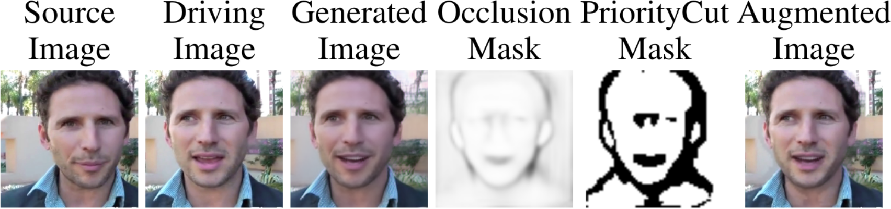

# Abstract 
Image animation generates a video of a source image following the motion of a driving video. State-of-the-art self-supervised image animation approaches warp the source image according to the motion of the driving video and recover the warping artifacts by inpainting. These approaches mostly use vanilla convolution for inpainting, and vanilla convolution does not distinguish between valid and invalid pixels. As a result, visual artifacts are still noticeable after inpainting. CutMix is a state-of-the-art regularization strategy that cuts and mixes patches of images and is widely studied in different computer vision tasks. Among the remaining computer vision tasks, warp-based image animation is one of the fields that the effects of CutMix have yet to be studied. This paper first presents a preliminary study on the effects of CutMix on warp-based image animation. We observed in our study that CutMix helps improve only pixel values, but disturbs the spatial relationships between pixels. Based on such observation, we propose PriorityCut, a novel augmentation approach that uses the top-k percent occluded pixels of the foreground to regularize warp-based image animation. By leveraging the domain knowledge in warp-based image animation, PriorityCut significantly reduces the warping artifacts in state-of-the-art warp-based image animation models on diverse datasets.

# Results

## VoxCeleb

<center>
<iframe width="800" height="200"
src="https://user-images.githubusercontent.com/64956291/112410217-332d9680-8d5e-11eb-8c9c-9c8961c85a2a.mp4"
frameborder="0"
allow="accelerometer; autoplay; encrypted-media; gyroscope; picture-in-picture"
allowfullscreen></iframe>

<iframe width="800" height="200"
src="https://user-images.githubusercontent.com/64956291/112411312-07131500-8d60-11eb-9cf4-69c6180e046e.mp4"
frameborder="0"
allow="accelerometer; autoplay; encrypted-media; gyroscope; picture-in-picture"
allowfullscreen></iframe>

<iframe width="800" height="200"
src="https://user-images.githubusercontent.com/64956291/112411375-2611a700-8d60-11eb-93cb-e7c6fe0bdfef.mp4"
frameborder="0"
allow="accelerometer; autoplay; encrypted-media; gyroscope; picture-in-picture"
allowfullscreen></iframe>
</center>

## BAIR

<center>
<iframe width="640" height="200"
src="https://user-images.githubusercontent.com/64956291/112411516-5fe2ad80-8d60-11eb-97b0-3544778d1765.mp4"
frameborder="0"
allow="accelerometer; autoplay; encrypted-media; gyroscope; picture-in-picture"
allowfullscreen></iframe>

<iframe width="640" height="200"
src="https://user-images.githubusercontent.com/64956291/112411533-6cff9c80-8d60-11eb-91da-7718b3c370ac.mp4"
frameborder="0"
allow="accelerometer; autoplay; encrypted-media; gyroscope; picture-in-picture"
allowfullscreen></iframe>
</center>

## Tai-Chi-HD

<center>
<iframe width="800" height="200"
src="https://user-images.githubusercontent.com/64956291/112411647-9b7d7780-8d60-11eb-8347-21a8b656ef1a.mp4"
frameborder="0"
allow="accelerometer; autoplay; encrypted-media; gyroscope; picture-in-picture"
allowfullscreen></iframe>

<iframe width="800" height="200"
src="https://user-images.githubusercontent.com/64956291/112411685-a6d0a300-8d60-11eb-96ca-1566cfbc9b63.mp4"
frameborder="0"
allow="accelerometer; autoplay; encrypted-media; gyroscope; picture-in-picture"
allowfullscreen></iframe>
</center>

# Citation 

```plain
@article{cheung2021prioritycut,
      title={PriorityCut: Occlusion-guided Regularization for Warp-based Image Animation}, 
      author={Wai Ting Cheung and Gyeongsu Chae},
      year={2021},
      eprint={2103.11600},
      archivePrefix={arXiv},
      primaryClass={cs.CV}
}
```
